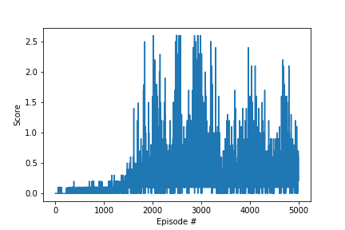

## Deep_Reinforcement_Learning_Udacity_Collaboration_and_Competition

This project implements Multi Agent Deep Deterministic Policy Gradient (MADDPG) algorithm to solve the tennis environment. In this environment, two agents control rackets to bounce a ball over a net. If an agent hits the ball over the net, it receives a reward of +0.1.  If an agent lets a ball hit the ground or hits the ball out of bounds, it receives a reward of -0.01.  Thus, the goal of each agent is to keep the ball in play.

The observation space consists of 8 variables corresponding to the position and velocity of the ball and racket. Each agent receives its own, local observation.  Two continuous actions are available, corresponding to movement toward (or away from) the net, and jumping. 

The task is episodic, and in order to solve the environment, agents must get an average score of +0.5 (over 100 consecutive episodes, after taking the maximum over both agents). Specifically,

- After each episode, we add up the rewards that each agent received (without discounting), to get a score for each agent. This yields 2 (potentially different) scores. We then take the maximum of these 2 scores.
- This yields a single **score** for each episode.

The environment is considered solved, when the average (over 100 episodes) of those **scores** is at least +0.5.

The agent implements Multi Agent Deep Deterministic Policy Gradient (MADDPG) learning method for continuous action spaces. The agent learns with actor-critic method in which both actor and critic is implemented with Fully Connected Network (FCN). There are two copies of both actor and critic networks called local and target networks. Target network weights are copied from local network weights after each learning step through soft update to blend in the new weights into previous weights.

The actor learns through self-play by storing both experiences for training but acts on its own state/observation. The critic also learns through self play during training but outputs state-action value based on both observation/state and its' agents' action. The actor network is FCN with 3 hidden layers of 128 neurons each. The critic network is also FCN network with 3 hidden layers of 128 neurons each. 

Environment is solved at episode 2000. Below is the plot of average score over 100 consecutive episode. 

Although solution is reached at episode 2000, learning is not stable and average score decreases/increases during later episodes. Priority experience replay, learning rate scheduling would help the training to stabilize.

